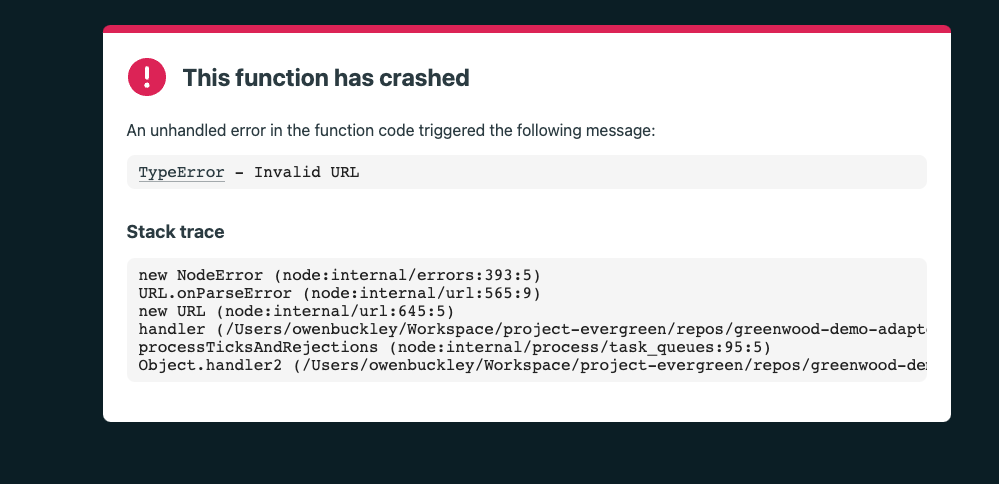

# greenwood-demo-adapter-netlify

[](https://app.netlify.com/sites/harmonious-gaufre-bb14cf/deploys)

> ⚠️ _**Note**: Currently this repo is a WIP_

A demonstration repo for using Greenwood with Netlify Serverless and Edge functions for APIs and SSR pages and used in part of crafting its design for [introducing platform "adapters" into Greenwood](https://github.com/ProjectEvergreen/greenwood/issues/1008).

## Setup

To run locally
1. Clone the repo
1. Run `npm ci`

You can now run these npm scripts
- `npm run dev` - Start the demo with Greenwood local dev server
- `npm run serve` - Start the demo with a production Greenwood build
- `npm run netlify` - Start the Netlify local dev server

> 👉 **Note**: _If deploying to your own Netlify instance, make sure you set the `AWS_LAMBDA_JS_RUNTIME` environment variable [in your Netlify UI](https://answers.netlify.com/t/aws-lambda-js-runtime-nodejs14-x/32161/2) to the value of  `nodejs18.x`_.

## Demo

This repo aims to demonstrate a couple of Greenwood's features ([API Routes](https://www.greenwoodjs.io/docs/api-routes/) and [SSR pages](https://www.greenwoodjs.io/docs/server-rendering/#routes)) leveraging Netlify's serverless and edge function capabilities, focused on using Web Components (WCC) and Web Standards to deliver the content for the demo.

## Status

|Feature    |Greenwood |Serverless|Edge|
|---------- |----------|----------|----|
|API Routes |   ✅     |  ⛔       | ❓ |
|SSR Pages  | ❓       | ❓        | ❓ | 

## Serverless

The serverless demos include the following examples:
- ✅ [`/api/greeting?name{xxx}`](https://harmonious-gaufre-bb14cf.netlify.app/api/greeting) - An API that returns a JSON response and optionally uses the `name` query param for customization.  Otherwise returns a default message.
- ⛔ [`/api/fragment`](https://harmonious-gaufre-bb14cf.netlify.app/api/fragment) - An API for returning fragments of server rendered Web Components as HTML, that are then appended to the DOM.  The same card component used in SSR also runs on the client to provide interactivity, like event handling.
- ⛔ [`/api/fragment-manual`](https://harmonious-gaufre-bb14cf.netlify.app/api/fragment-manual) - Same as the above API, but using WCC in a more "manual" fashion for comparison since Netlify / esbuild does not support `import.meta.url`.

### API Routes

####  ⛔ import.meta.url

Seeing this issue when creating an "idiomatic" example of a custom element using WCC's `renderFromHTML` because [Netlify / esbuild](https://github.com/evanw/esbuild/issues/795) does not support `import.meta.url`, though hopefully it is [coming soon](https://github.com/evanw/esbuild/pull/2508 )? 🥺



```js
import { renderFromHTML } from 'wc-compiler';
import { getArtists } from '../services/artists.js';

export async function handler(request) {
  const params = new URLSearchParams(request.url.slice(request.url.indexOf('?')));
  const offset = params.has('offset') ? parseInt(params.get('offset'), 10) : null;
  const headers = new Headers();
  const artists = await getArtists(offset);
  const { html } = await renderFromHTML(`
    ${
      artists.map((item, idx) => {
        const { name, imageUrl } = item;

        return `
          <app-card
            title="${offset + idx + 1}) ${name}"
            thumbnail="${imageUrl}"
          ></app-card>
        `;
      }).join('')
    }
  `, [
    new URL('../components/card.js', import.meta.url)
  ]);

  headers.append('Content-Type', 'text/html');

  return new Response(html, {
    headers
  });
}
```

The above would be the ideal implementation, so instead have to do something more "manual" for now.
```js
import '../../node_modules/wc-compiler/src/dom-shim.js';
import { getArtists } from '../services/artists.js';
import Card from '../components/card.manual.js';

export async function handler(request) {
  const params = new URLSearchParams(request.url.slice(request.url.indexOf('?')));
  const offset = params.has('offset') ? parseInt(params.get('offset'), 10) : null;
  const headers = new Headers();
  const artists = await getArtists(offset);
  const card = new Card();
  
  card.connectedCallback();

  const html = artists.map((artist) => {
    const { name, imageUrl } = artist;
    return `
      <app-card-manual>
        ${card.getInnerHTML({ includeShadowRoots: true })}

        <h2 slot="title">${name}</h2>
        
      </app-card-manual>
    `;
  }).join('');

  headers.append('Content-Type', 'text/html');

  return new Response(html, {
    headers
  });
}
```

####  ⛔ ERR_REQUIRE_ESM

So although this runs fine locally for `/api/fragment-manual`, when run on Netlify, the `ERR_REQUIRE_ESM` message is seen.


### SSR Pages

TODO

## Edge

TODO

### API Routes

TODO

### SSR page

TODO

## Adapter Implementation Thoughts / Questions

1. Will need to generate the _.netlify/functions_ folder on-demand / as part of the build instead of hardcoding, likely from _manifest.json_
1. How to best manage local dev (runtime "compliance")
    - proxy netlify cli dev option?
    - should use src or public?  depends on dev vs production mode?